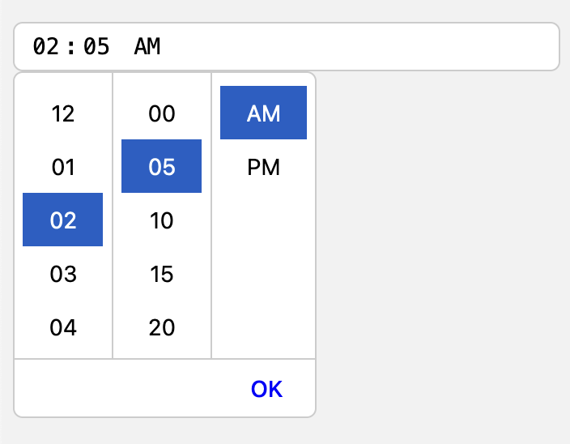

# Svelte Time Picker

## What is it?

A very simple time picker component for Svelte, inspired by Material UI's time picker.

## Installation

```bash
npm install @rschiang/svelte-timepicker
```

## Usage

```svelte
<script>
    import { TimePicker } from "@rschiang/svelte-timepicker";

    let hours = null;
    let minutes = null;
</script>

<TimePicker onChange={(h, m) => {
    hours = h;
    minutes = m;
}} />
```

## Demo

[https://svelte.dev/repl/54e378a10dac4c8cabd9d938d40a9364?version=4.2.8](https://svelte.dev/repl/54e378a10dac4c8cabd9d938d40a9364?version=4.2.8)



## Properties

| Property | Type | Description |
| ----------- | ----------- | ----------- |
| hours? | `number \| null` | Controls the hours value. |
| minutes? | `number \| null` | Controls the minutes value. | 
| onChange? | `function \| null` | Function with two parameters: `hours` and `minutes`. |
| containerClass? | `string` | Class name for the container element. |
| inputClass? | `string` | Class name for the input element. |
| popoverClass? | `string` | Class name for the popover element. |
| popoverHeaderClass? | `string` | Class name for the popover header element. |
| popoverHeaderColClass? | `string` | Class name for the popover header column element. |
| popoverHeaderBtnClass? | `string` | Class name for the popover header button element. |
| popoverFooterClass? | `string` | Class name for the popover footer element. |
| popoverFooterBtnClass? | `string` | Class name for the popover footer button element. |

## License

MIT